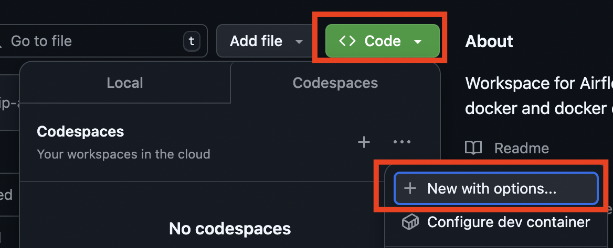
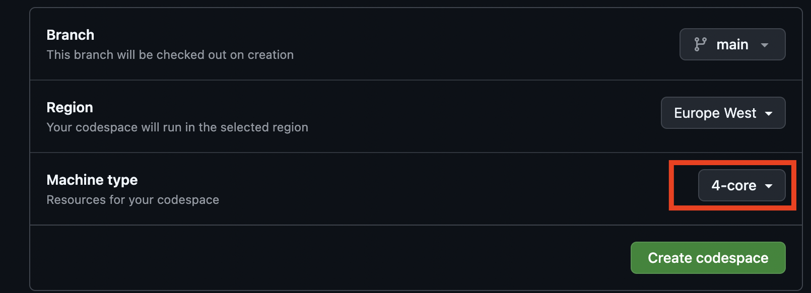
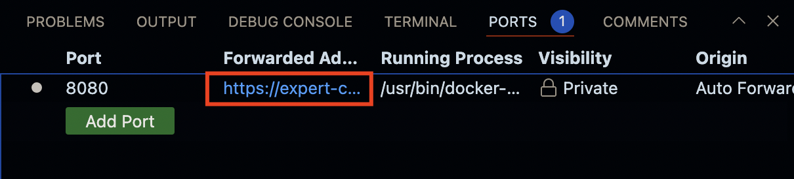
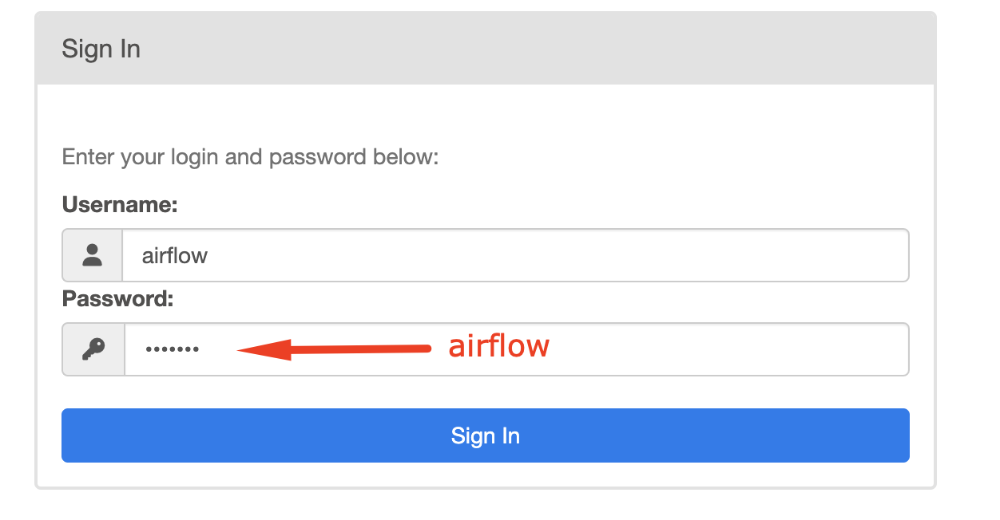

# Airflow training - 16/17 December 2024

Hello! 👋🏻

This repository will be used for sharing training material and details for the Airflow Training, 16 and 17 December 2024.

The training will be from 09:00 - 17:00 at the [Xebia Office, Wibautstraat 200, Amsterdam](https://maps.app.goo.gl/MqoHeDCZb1WT3Mgb6)

# 🛠️ Setup

To complete this course you will need:

1. A laptop that is able to access Google Cloud Platform and GitHub. If you will be bringing a company laptop please be aware that these can often have access restrictions.
2. [A Google account](https://accounts.google.com/lifecycle/steps/signup/name?continue=https://accounts.google.com/&ddm=1&dsh=S-1120695220:1733920506926603&flowEntry=SignUp&flowName=GlifWebSignIn&followup=https://accounts.google.com/&ifkv=AeZLP99wau7csd-mYro3OUzG2xDmgSRhkEyxOFlyu1tWh5EJEE1FS3ThwB7JsbUhlag8p6JepIIwdA&TL=AE--LlwuUjmHaUJMovF_QaAYVgqEdxemHqGk4PP8UWBSKBp1IRq9jhafO3GGAPGF) - if you have a Gmail account you already have one. **Please send the email address associated with this account to the trainer by end-of-day Sunday December 15.** This is needed to add you to the development environment
3. [A GitHub account](https://github.com/signup?ref_cta=Sign+up&ref_loc=header+logged+out&ref_page=%2F&source=header-home) (for use with GitHub Codespaces) 
4. Optional: A locally running instance of Docker Desktop if you would prefer to run Airflow locally. (We generally recommend the use of GitHub in the training to avoid setup issues)

💬 A chat has been setup for our group and can be found at https://bit.ly/airflow_ftw (you will have been invited if you've shared your Google Cloud account with the trainer)

# ⏰ Schedule

The course will loosely follow this schedule:

### Day 1

- What is Airflow?
- Installation
- The Airflow UI
- Coding a DAG
- Scheduling
- Airflow Context
- Sensors

### Day 2
- Airflow Metastore
    - Connections
    - Hooks
    - Variables
    - XComs
- Branching/Triggering
- Backfilling
- Completing the Capstone Project


# 🏎️ Getting started

1. On the repository page in Github, select "Code" and "New with options..."

    

1. Ensure that you select "4-core" and select "Create codespace"

    

1. Check that you have enough memory allocated to your codespaces instance. In the terminal (ctrl + ` ) check that you have more than 4GB of allocated memory:

    ```
    docker run --rm "debian:bullseye-slim" bash -c 'numfmt --to iec $(echo $(($(getconf _PHYS_PAGES) * $(getconf PAGE_SIZE))))'
    ```

1. Start all services:
    ```
    docker compose up
    ```

1. The Airflow web UI will available at: http://localhost:8080.  To access this in the workspace, you will need to make use of a forwarded address.  This can be accessed under "PORTS"

    1. Press "ctrl+shift+P" -> Type "ports" -> Select "Ports: Focus on Ports View"
    1. Select the link under "Forwarded Address"

    

1. Login to Airflow:

    

# Virtual environment

Setup a virtual environment as follows:
In the terminal run:
```sh
python -m venv .venv
```

Then
```sh
source ./.venv/bin/activate
```

Then
```sh
pip install -r requirements.txt
```

# Miro

https://bit.ly/airflow_miro
